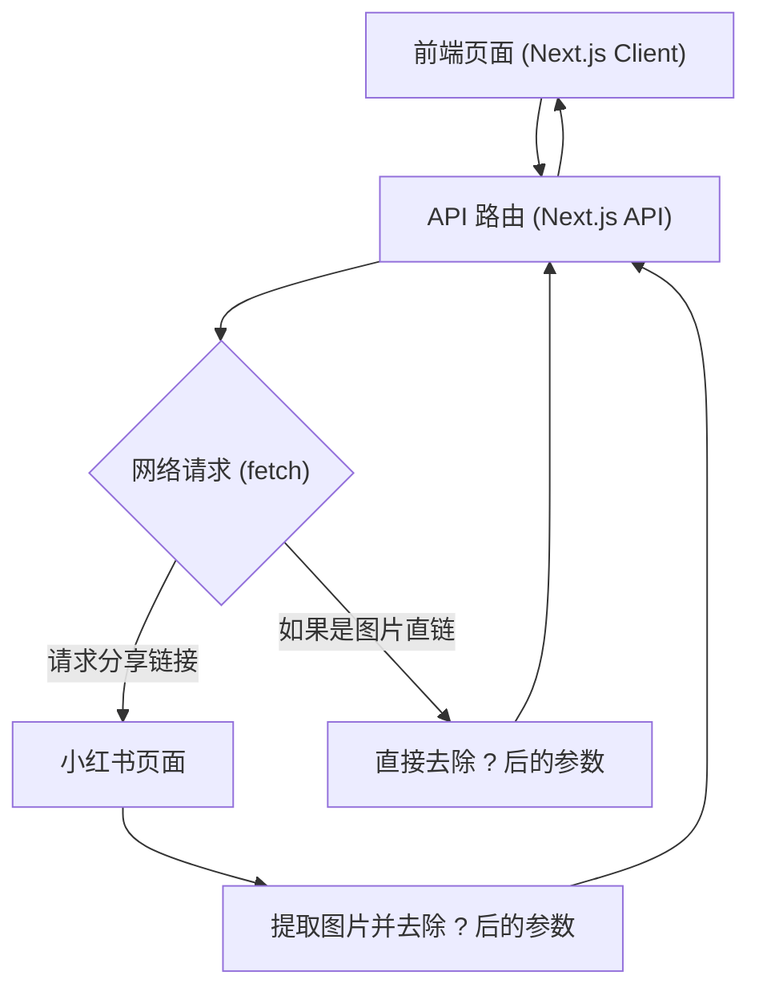
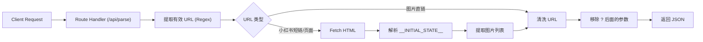

## 1. 架构设计



## 2. 技术说明
- 前端框架：Next.js (App Router, React 18)
- 样式库：Tailwind CSS (响应式、极简风格)
- 图标库：lucide-react
- 后端服务：Next.js Route Handlers (处理链接抓取和参数过滤)
- 核心功能依赖：正则表达式解析 HTML 中的初始状态 (如 `window.__INITIAL_STATE__`) 来提取图片 URL，并过滤 `?` 参数。

## 3. 路由定义

| 路由 | 目的 |
|-------|---------|
| `/` | 首页：提供分享链接输入与结果预览 |
| `/api/parse` | 核心 API：接收用户链接，解析并返回无水印图片数组 |

## 4. API 定义

### `POST /api/parse`

#### 请求参数
```typescript
interface ParseRequest {
  url: string; // 用户输入的小红书分享链接文本，可能包含文字描述
}
```

#### 响应结构
```typescript
interface ParseResponse {
  success: boolean;
  images?: string[]; // 去除水印后的原图 URL 列表
  error?: string; // 错误信息，如 "解析失败，无效的链接"
}
```

## 5. 服务端架构图


