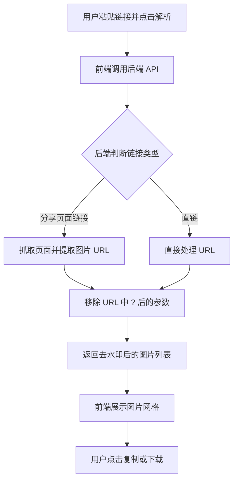

## 1. 产品概述
本产品是一款基于 Next.js 和 Tailwind CSS 构建的网页版小红书图片去水印工具。
- 解决问题：帮助用户方便快捷地获取无水印的高质量小红书原图。
- 核心受众：需要保存素材、图片创作者以及普通用户。
- 核心价值：通过简单直观的界面，自动解析分享链接或图片链接，去除URL参数中的水印部分，提供一键复制与下载功能。

## 2. 核心功能

### 2.1 用户角色
| 角色 | 注册方式 | 核心权限 |
|------|---------------------|------------------|
| 普通用户 | 无需注册 | 浏览页面、输入链接解析原图、复制链接、下载图片 |

### 2.2 功能模块
1. **首页**：顶部导航、居中对齐的英雄区域（输入框与解析按钮）、解析结果预览区（网格展示图片列表）。
2. **交互动作**：一键复制图片地址、一键下载图片。

### 2.3 页面详情
| 页面名称 | 模块名称 | 功能描述 |
|-----------|-------------|---------------------|
| 首页 | 链接输入区 | 支持粘贴小红书分享链接或带参数的图片直链，点击“解析”触发后端请求 |
| 首页 | 结果展示区 | 以优雅的图片网格（瀑布流或卡片式）展示去水印后的图片 |
| 首页 | 操作控制栏 | 每张图片下方或悬浮展示“复制链接”与“下载图片”按钮 |

## 3. 核心流程
用户核心流程描述：
1. 用户在输入框中粘贴小红书分享内容或图片链接。
2. 用户点击“解析”按钮。
3. 前端将链接发送至后端 API。
4. 后端通过正则表达式或 HTML 解析提取图片 URL，并去除 URL 中 `?` 之后的水印参数。
5. 前端接收到无水印的图片数组，在结果展示区渲染预览图。
6. 用户点击复制按钮复制图片链接，或点击下载按钮将原图保存到本地。

## 4. 用户界面设计

### 4.1 设计风格
- 主题颜色：以小红书标志性的红色（如 `#ff2442`）为主色调，搭配纯白背景与浅灰辅助色，呈现干净清爽的视觉感受。
- 按钮样式：大圆角（`rounded-2xl` 或 `rounded-full`），带轻微阴影，悬浮时有平滑的颜色过渡或缩放反馈。
- 字体排版：使用无衬线字体（如 Inter, System UI），大字号标题，清晰的层级关系。
- 布局风格：极简的居中卡片式布局，大面积留白，突出核心输入功能。
- 图标风格：使用 Lucide React 图标库，保持线性和现代感。

### 4.2 页面设计概览
| 页面名称 | 模块名称 | UI 元素 |
|-----------|-------------|-------------|
| 首页 | 英雄区域 | 大标题（渐变色或品牌红）、居中的大型输入框、醒目的主按钮、加载动画（Spinner） |
| 首页 | 结果展示区 | 圆角图片卡片（Hover 时显示遮罩和操作按钮）、平滑过渡动画 |

### 4.3 响应式设计
- 桌面端优先设计（Desktop-first），中心最大宽度约束（如 `max-w-3xl`）。
- 移动端适配：输入框与按钮在移动端可能垂直排列，图片展示由多列切换为单列或双列，确保触控目标的尺寸适宜。
